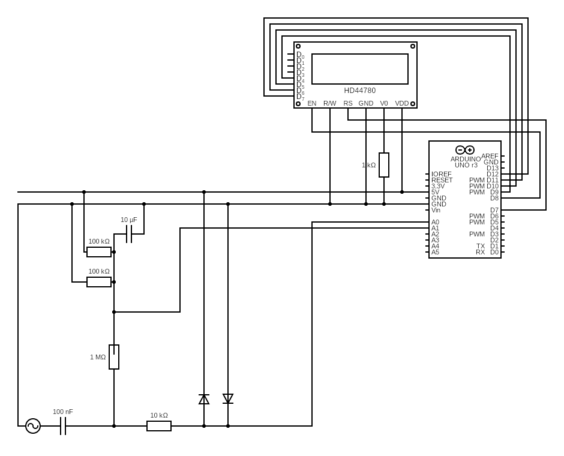

# Arduino Guitar Tuner 🎸

A guitar tuner built from scratch using Arduino, autocorrelation-based pitch detection, and a 16x2 LCD.

## Features
- Autocorrelation pitch detection (robust fundamental detection)
- Works with passive and active pickups
- Boss-style tuning bar display
- 16x2 HD44780 LCD
- Analog input with VBIAS conditioning

## Hardware
- Arduino Uno / Nano
- Guitar input (P10 / TS)
- Bias network (VBIAS ~2.5V)
- 1602 LCD

## Schematic

## Signal Path Explained

This tuner is designed to safely interface a guitar signal with an Arduino’s ADC, while preserving pitch accuracy and avoiding damage to both the instrument and the microcontroller.

Below is a step-by-step explanation of how the signal flows through the circuit.

---

### 1. Guitar Output (AC Signal Source)

A guitar pickup outputs a **low-level AC signal** centered around 0 V.

- Passive single-coil and humbucker pickups typically produce tens to hundreds of millivolts.
- Active pickups output a stronger, buffered signal but are still AC-coupled.

The Arduino ADC **cannot accept negative voltages**, so this signal must be conditioned before sampling.

---

### 2. Input Coupling Capacitor (100 nF)

The guitar signal first passes through a **DC-blocking coupling capacitor**:

- Blocks any DC offset from the guitar or external equipment  
- Allows only the AC waveform to pass  

This ensures:
- No DC is injected into the bias network  
- The pickup sees a high-impedance load (no tone loss)

---

### 3. Input Impedance & Bias Injection (1 MΩ + VBIAS)

After AC coupling, the signal is referenced to a virtual ground:

- A **1 MΩ resistor** pulls the signal toward VBIAS  
- Creates a high-impedance input similar to an amplifier input  
- Prevents the signal from floating when no cable is connected  

This stage ensures stability and minimizes noise.

---

### 4. VBIAS (Virtual Ground at 2.5 V)

The Arduino runs on a **single 5 V supply**, so audio must be centered at mid-supply.

VBIAS is created using:
- Two **100 kΩ resistors** forming a voltage divider between 5 V and GND  
- A **10 µF capacitor** to ground for noise filtering and stability  

Result:
- A clean **2.5 V reference**  
- Acts as a “fake ground” for the audio signal  

All audio entering the ADC is centered around this voltage.

---

### 5. Series Protection Resistor (10 kΩ)

Before reaching the ADC pin, the signal passes through a **10 kΩ series resistor**:

- Limits current into the Arduino’s internal protection diodes  
- Protects against accidental overvoltage  
- Reduces high-frequency noise  

---

### 6. Clamp Diodes

Two diodes clamp the signal to safe limits:

- One to **5 V**  
- One to **GND**  

Purpose:
- Prevent ADC input from exceeding the safe voltage range  
- Protect against hot active pickups or accidental line-level input  

These diodes only conduct during fault conditions and do not affect normal operation.

---

### 7. Arduino ADC (A0)

The conditioned signal enters **A0**, where it is sampled:

- Centered at ~512 (mid-scale)  
- Audio waveform swings above and below VBIAS  
- Captured at ~4 kHz sample rate  

The firmware:
- Removes the DC bias  
- Computes amplitude  
- Applies autocorrelation to extract the fundamental frequency  

---

### 8. Digital Signal Processing

Once sampled, the signal is processed entirely in software:

1. DC offset removal  
2. Amplitude gating (noise rejection)  
3. Autocorrelation  
4. Parabolic interpolation  
5. Frequency → note + cents conversion  

---

### 9. LCD Output

The detected pitch is displayed on a **16×2 HD44780 LCD**:

- Line 1: Note name, octave, frequency  
- Line 2: Tuning indicator (flat / in tune / sharp)  

A moving bar provides intuitive visual feedback similar to a commercial pedal tuner.

## License
MIT
